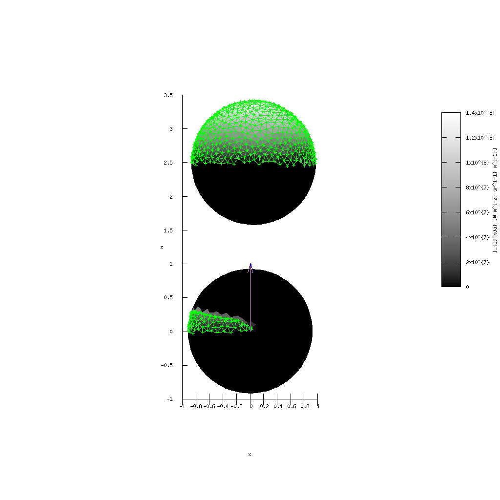

Test of lightcurve computation for a general polygonal mesh.

The following physics was already implemented:

- shadowing (non-convex), eclipses, transits, ...
- bounding-box test
- Openmp parallelization

2DO list:

- insolation
- visibility (mutual)
- scatterring (mutual)
- simplified thermal contribution
- Lambert law
- Lommel law
- Hapke law
- above-horizon test
- simplified motion
- body rotation
- lightcurve
- synthetic image (AO)
- integration with Vispy
- integration with Xitau?

